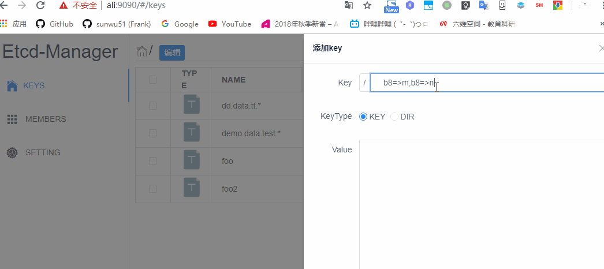
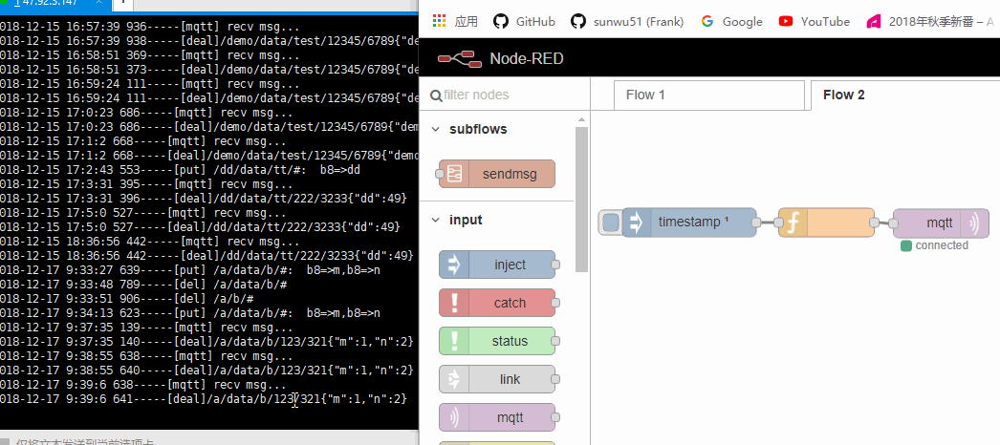

# 项目重构
之前的设计上有很多比较复杂的设计，比如kylin hdfs elasticsearch等，实验室连机器都凑不出来的简陋条件下，没法搞。

另外有些设计的扩展性和性能太差，比如Node-Red这种东西以后就不要用了，害人害己。
# 新的后台构架


这里只修改了数据采集解析存储部分，没有对管理后台的改动。主要是将原来的存储topic和对应解析方式的数据库，从json-server改成了etcd，然后数据最后存储的位置从es改成了mongodb和百度的时序数据库。

etcd本身就是键值对存储的分布式数据库，还提供了rest接口，另外也有开源的管理界面，所以比json-server靠谱一些。es则是占用内存太大，阿里云的机器根本撑不住，换成了mongodb官网提供的免费服务器，然后同时存到了百度的时序数据库。

# etcd
这里要先介绍etcd，这是一个k-v数据库，类似redis的k-v。存储了topic--pattern的键值对，即某个topic要用什么样的解析方式来将byte数据转为json数据。

例如存储`{"/a/b/c":"b8=>test"}`即对应/a/b/c这个topic，recv部分要对这个topic收到的数据进行解析，将前八个字节转换为uint8，作为test字段。例如收到数据0x01，则转为json为`{"test":1}`。其他的解析规则字符串的说明参考[https://github.com/sunwu51/mesh_recv/blob/v1/test.js](https://github.com/sunwu51/mesh_recv/blob/v1/test.js)

etcd的安装和管理界面，直接使用[https://github.com/shiguanghuxian/docker-compose/tree/master/etcd33](https://github.com/shiguanghuxian/docker-compose/tree/master/etcd33).修改config文件中root_key=root，改为root_key=mesh。用这个项目的docker-compose部署。

另外我们需要注意etcd的key不能存`/`和`#`，我们用`.`和`*`分别替代。


# recv & save
直接去mesh_recv和mesh_save然后分别运行server.js即可。如果要修改相关配置可以改config.js。

# 网关->mqtt->recv
在etcd管理页面添加一个topic符合`/{section}/data/{datatype}/{gseq}/{nseq}`这样格式，添加解析字符。例如
```
/a/data/b/#      b8=>m,b8=>n
```
#可以匹配任意，注意替换/和# 为 .和*

通过程序模拟，往`/{section}/data/{datatype}/{gseq}/{nseq}`这样格式的topic发送数据。


来看下recv的日志：  
  
上图可以看出我们发的byte数据已经收到并解析为json数据了。

再来看下save的日志：
  
上图可以看出json数据已经被save服务接收并存入了mongodb和tsdb。

到mongodb和tsdb查询下，发现数据确已存入。
  

