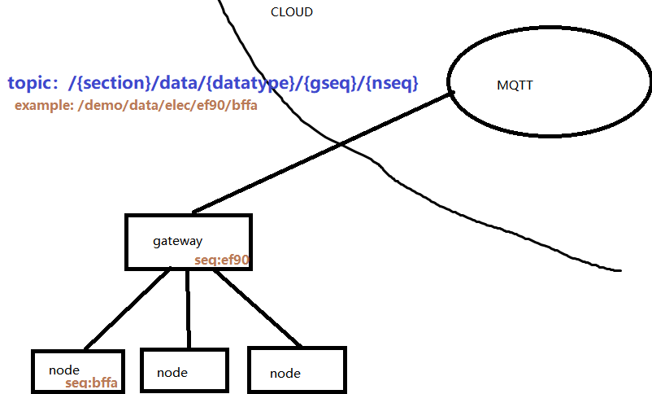
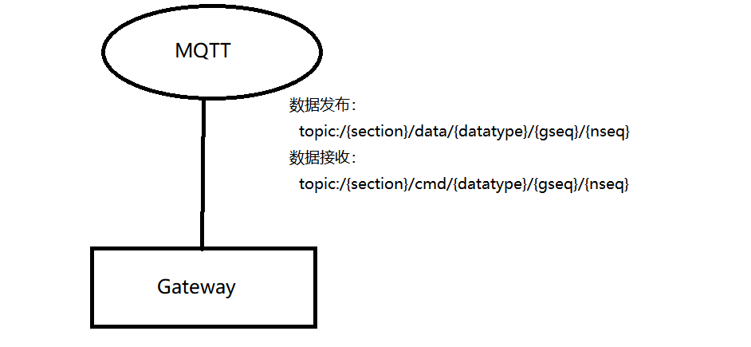
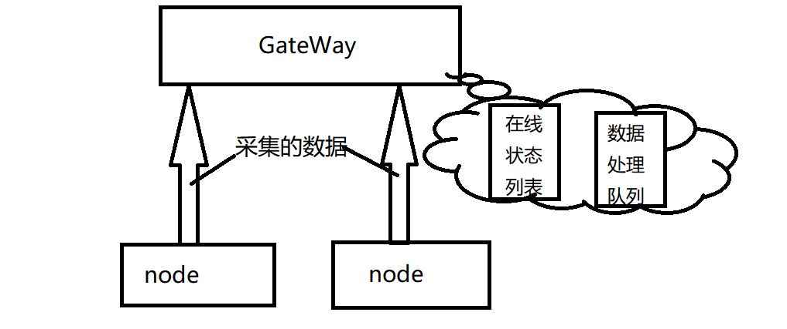

# 硬件部分在接入过程中的关注点
# 1 硬件编排问题
每个硬件都需要有个序列号(seq)，序列号采用何种方式写入到硬件中（网关、单片机）？  
设想：网关可以通过配置文件进行序列号的写入，单片机需要进一步讨论每种单片机节点可以支持的形式，最好是不要写死在代码，写死代码会带来很多烧写上的重复工作。
# 2 网关“代言”传感器问题
单片机没有网卡，即不可能直接使用mqtt协议，需要通过网关代言。由网关作为mqtt的客户端，发送下属的所有节点的数据。  
  
## 2.1 网关管理节点
网关需要能感知节点是否在线，并且在上线和下线的时候需要对相关主题的订阅和退订，间接通知服务器节点的上线和下线状态。  

网关需要节点传过来的数据是来自哪个节点(seq)，并将数据发布到指定的Topic上。

# 3 数据加工
节点传给网关的数据不一定是能直接传给云端的，比如有些数据量巨大，云端要接收很多网关的数据，这样多的数据并发是不能承受的。
## 3.1 大规模数据的预处理
比如采样频率很高的数据，需要网关部分进行简单的分析和提取这样的预处理。再将处理结果发送到云。
## 3.2 数据类型的规范化
避免奇葩数据类型，比如实际值应为`采集值-10`之类的。尽量保证所有数据的类型都为(u)int1-64或float32/64。
# 4 本地服务定制化
云端的服务是针对大多数场景的，不能满足个性化的定制。一般需要在本地(如工厂内)建立本地的服务(如数据解析，存储，处理，展示)。
## 4.1 数据分流
将数据分为两份，一份按照定好的topic发到云端，另一份自己进行处理。
