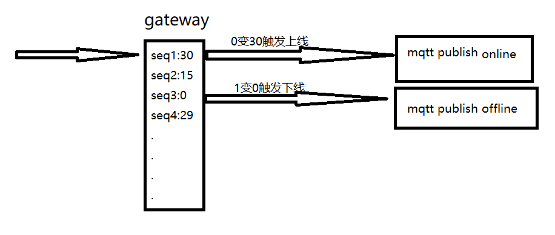

# 1 本周解决的问题
## 1.1 序列号写入和读取问题
在传感器节点中添加序列号，并且在数据传输的时候需要追加序列号。
## 1.2 节点状态列表维护
在网关上，通过`Redis`存储节点状态，用王老师之前的思路。（设置一个时间值如30，每秒-1，如果有数据来则重置为30，这样只有30s都没有数据来，该值变成0，当值变为0时触发一个事件，将节点离线的消息传到服务端）  
  
## 1.3 数据转换问题
需要在网关将所有预处理好的数据，转换成byte类型。
```javascript
/**
 * 例如将int16的值转成byte的js写法 
*/
var i=9;
var bf = Buffer.alloc(2);
bf.writeInt16BE(i);
console.log(bf);
//打印 <Buffer 00 09>
```
## 1.4 整合前面所有方案
实现
- 1 节点和网关注册在云端
- 2 节点和网关在线状态的可感知
- 3 节点数据的上传和解析

